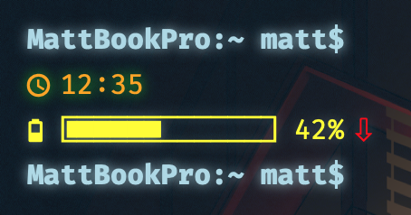

# BASH TERMINAL widget
My slight modification of Viktor's Widget




## Features
**Clock**

**Username**

**Battery status**

## Modified Features
**12 Hour Clock**

**Username similar to my terminal**

**Ascii Characters for Battery**
 
## Instalation
1. Clone this repository or download a [zip file](terminal.widget.zip)
```
git clone https://github.com/DeathWired/ubersicht-termina-widget ~/Library/Application\ Support/Übersicht/widgets/ubersicht-termina-widget/
```

## Requirements
1. Übersicht of course

## Customization
You can set brightness of the neon effect
```
brightness = 10
```

## Enjoy!
Fork it, learn with it, do whatever with it. Just remember to have fun!

